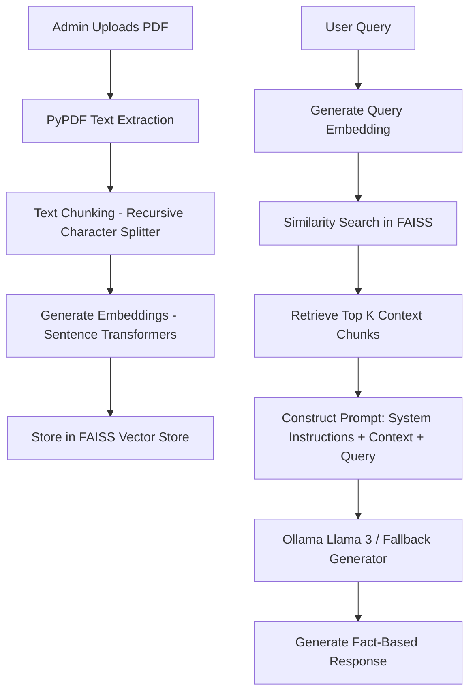
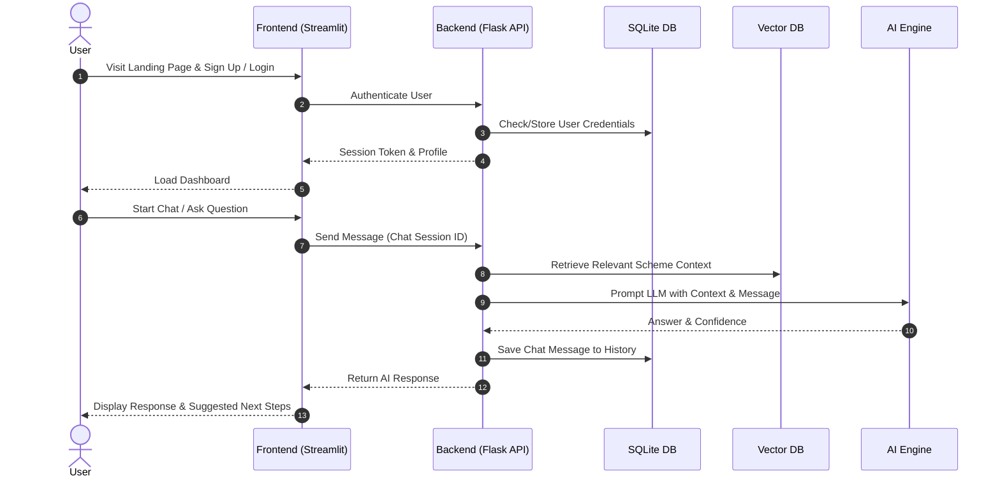
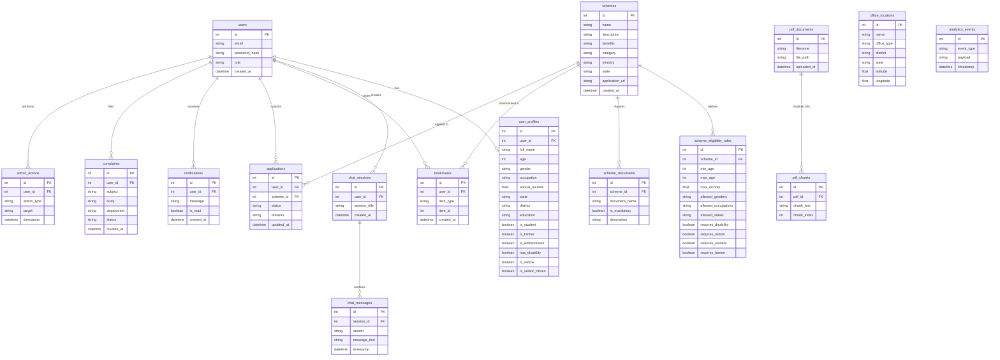

# GovAssist AI - Complete System Documentation & Architectural Blueprint

This document contains the comprehensive blueprint and design specifications for **GovAssist AI – Intelligent Government Citizen Assistant**.

---

## 1. Problem Statement
In India, the government runs hundreds of welfare schemes and services across central, state, and local levels. However, citizens face significant barriers:
- **Information Asymmetry:** Citizens do not know which schemes they qualify for.
- **Complex Eligibility Criteria:** Rules are hidden in bureaucratic PDF documents.
- **Language Barriers:** Official portals are often in English or Hindi, leaving regional language speakers excluded.
- **Manual, Tedious Forms:** Forms are long and complex, leading to errors.
- **Fragmented Systems:** Finding offices, generating complaints, and checking checklists require visiting multiple websites.

## 2. Proposed Solution
**GovAssist AI** is a single, unified, AI-powered citizen assistant that simplifies access to Indian government services:
- **Intelligent Chatbot:** An LLM-powered assistant (via Ollama/Llama 3 or fallback) that can answer queries, explain schemes, and retrieve details from official documents using RAG.
- **Unified Scheme Recommender & Eligibility Checker:** Evaluates citizen profiles against complex criteria to suggest matching schemes with confidence scores and explanations.
- **Document & Application Helper:** Generates checklists, guides steps, pre-fills forms using OCR (EasyOCR), and creates official complaints.
- **Accessibility Features:** Multilingual voice assistant (Whisper & gTTS) supporting English, Hindi, Tamil, and Malayalam, and OpenStreetMap integration for office discovery.
- **Admin Panel & Analytics:** Allows officials to upload scheme PDFs, monitor search trends, and manage eligibility rules.

---

## 3. System Architecture

```mermaid
graph TD
    subgraph Client Layer [Frontend - Streamlit]
        UI[User Dashboard & Views]
        Chat[AI Chat & Voice interface]
        Maps[Office Locator - OSM/Folium]
        Forms[Form Filler & OCR Uploder]
        AdminUI[Admin Analytics & Control]
    end

    subgraph Service Layer [Backend - Flask API]
        Auth[Auth & Session Manager]
        ChatSvc[Chat & History Controller]
        SchemeSvc[Scheme & Eligibility Engine]
        RAGSvc[RAG PDF Search Controller]
        OCRSvc[OCR & Auto-Fill Controller]
        VoiceSvc[Voice Processing Controller]
        AdminSvc[Admin & Analytics Engine]
    end

    subgraph Storage & AI Layer
        DB[(SQLite / PostgreSQL)]
        VDB[(FAISS Vector DB)]
        LLM[Ollama Llama 3 / Fallback LLM]
        Embed[Sentence Transformers]
        OCR[EasyOCR Engine]
        TTS_STT[gTTS & Whisper / SpeechRec]
    end

    Client Layer -->|HTTP / REST| Service Layer
    Service Layer --> DB
    Service Layer --> VDB
    Service Layer --> LLM
    Service Layer --> Embed
    Service Layer --> OCR
    Service Layer --> TTS_STT
```

---

## 4. AI RAG Workflow Pipeline


---

## 5. User Flow Diagram


---

## 6. Database ER Diagram



---

## 7. Folder Structure

```
govassist_project/
├── backend/
│   ├── __init__.py
│   ├── app.py
│   ├── database.py
│   ├── config.py
│   ├── models/
│   │   ├── __init__.py
│   │   └── db_models.py
│   ├── routes/
│   │   ├── __init__.py
│   │   ├── auth.py
│   │   ├── chat.py
│   │   ├── schemes.py
│   │   ├── pdf_search.py
│   │   ├── ocr.py
│   │   ├── voice.py
│   │   ├── complaints.py
│   │   ├── office_finder.py
│   │   ├── dashboard.py
│   │   ├── admin.py
│   │   └── notifications.py
│   └── ai_engine.py
├── frontend/
│   ├── __init__.py
│   ├── app.py
│   ├── utils.py
│   ├── pages/
│   │   ├── dashboard.py
│   │   ├── chat.py
│   │   ├── scheme_recommender.py
│   │   ├── scheme_search.py
│   │   ├── document_ocr.py
│   │   ├── office_finder.py
│   │   ├── complaints.py
│   │   └── admin_panel.py
│   └── components/
│       ├── chat_ui.py
│       └── ui_helpers.py
├── data/
│   └── seed_data.json
├── vectorstore/
│   └── .gitkeep
├── tests/
│   ├── test_auth.py
│   ├── test_ai.py
│   └── test_schemes.py
├── docs/
│   └── documentation.md
├── output/
│   └── .gitkeep
├── requirements.txt
├── Dockerfile
├── docker-compose.yml
└── README.md
```

---

## 8. Complete Module List
- **Auth (Backend/Frontend):** User signup, login, session validation, profile update.
- **Dashboard:** Profile overview, quick access buttons, recent notifications, bookmarked schemes.
- **Chat:** Multi-turn conversational interface with LLM prompt wrapper, fallback mock responses, memory retention, RAG document injection, follow-up query suggestions.
- **Scheme Recommender & Eligibility Engine:** Custom filtering rule-engine with weighted scores, explanation generation, scheme comparison module.
- **RAG & PDF Processor:** PDF extraction via PyPDF, text chunking, FAISS search, semantic indexing.
- **OCR Reader & Auto-Fill:** EasyOCR integration (with image thresholding and mock fallback for zero-GPU/unsupported machines), prefill mock application form.
- **Voice System:** Whisper/SpeechRecognition wrapper for STT, gTTS wrapper for translation/TTS in Malayalam, Tamil, Hindi, English.
- **Office Locator:** OSM/Folium rendering based on DB coordinates.
- **Complaint Generator:** Formal text template generator based on user input.
- **Admin Panel & Analytics:** File uploading endpoint, CRUD operations on schemes, aggregate dashboard analytics.

---

## 9. Page-wise Design & UI Elements
- **Login / Register:** Deep navy background, neat forms, clear tab switches, input helper texts.
- **Dashboard:** Metric cards for "Eligible Schemes Found", "Active Applications", "Notifications".
- **AI Chat Room:** Classic chat bubble stream, user bubble vs government agent bubble, follow-up recommendation chips.
- **Eligibility Checker Form:** Segmented wizard (Demographics -> Occupation & Income -> Special Categories).
- **OCR Form Prefiller:** Column 1: Upload ID document (Aadhaar/PAN preview); Column 2: Prefilled form side-by-side with accuracy markers.
- **Scheme Comparison:** Table grid side-by-side showing benefits, documents, age criteria, and state limitations.
- **Office Locator:** Interactive map container alongside search bar filters (office type, district).

---

## 10. Database Tables & DDL Schema
Refer to `backend/database.py` for full SQLite DDL representations using Python SQL Alchemy models.

## 11. API Endpoints
- `POST /api/auth/register` - Create user
- `POST /api/auth/login` - Authenticated session creation
- `GET /api/auth/profile` - Fetch current user profile
- `POST /api/auth/profile` - Update profile parameters
- `POST /api/chat/message` - Send query and retrieve LLM/RAG responses
- `GET /api/chat/history` - Retrieve messages for session
- `POST /api/schemes/recommend` - Query engine for personalized schemes
- `GET /api/schemes/search` - Text based query search
- `POST /api/pdf/upload` - Chunk, embed and insert a new scheme document
- `POST /api/ocr/extract` - Upload card image and extract key values
- `POST /api/complaints/generate` - Produce formal complaint document
- `GET /api/offices/search` - Retrieve geo-coordinates for nearby offices
- `GET /api/admin/analytics` - Get analytics aggregates

---

## 12. Python Packages (`requirements.txt`)
- `Flask==3.0.3`
- `Flask-SQLAlchemy==3.1.1`
- `Flask-Login==0.6.3`
- `Flask-Cors==4.0.1`
- `streamlit==1.36.0`
- `requests==2.32.3`
- `pypdf==4.2.0`
- `sentence-transformers==3.0.1`
- `faiss-cpu==1.8.0.post1`
- `easyocr==1.7.1` (or mock-based lightweight wrapper)
- `gTTS==2.5.1`
- `SpeechRecognition==3.10.4`
- `folium==0.17.0`
- `streamlit-folium==0.21.0`
- `pandas==2.2.2`
- `numpy==1.26.4`
- `torch==2.3.1` (optional for local models, with fallback)

---

## 13. Folder-wise Explanation
- **backend/**: Pure REST API built using Flask. Does not output HTML, only JSON. Houses database models, routes, and AI/RAG engine logic.
- **frontend/**: Streamlit client application. Communicates with Flask backend.
- **data/**: Initial seeding JSON files containing scheme data, office locations, and mock credentials.
- **vectorstore/**: Directory storing local FAISS indices.

---

## 14. Implementation Order
1. Setup virtual environment and dependency stack.
2. Build backend core structures: database connection (`database.py`), data models, and initial seed loading logic.
3. Construct backend APIs (Auth, Schemes, Maps, OCR, Complaints).
4. Implement AI engine module: PyPDF parser, FAISS vector indexing, and fallback mock LLM logic.
5. Create frontend Streamlit UI views corresponding to each feature.
6. Connect frontend APIs with backend endpoints.
7. Test the full citizen journey from register to dashboard, chat, check, search, fill, map, and logout.
8. Set up Docker containerization files.

---

## 15. Development Roadmap & Milestones
- **Milestone 1:** Basic user registration, profile setup, and scheme data storage (Day 1).
- **Milestone 2:** Scheme recommender engine and search APIs operational (Day 2).
- **Milestone 3:** Chat room and RAG search indexing functional (Day 3).
- **Milestone 4:** Document OCR, Voice integration, and Office Locator map components ready (Day 4).
- **Milestone 5:** Admin Panel, UI/UX premium polishing, and Docker setup (Day 5).

---

## 16. Weekly/Daily Action Plan
- **Day 1:** Database setup & seed population. Auth API + UI.
- **Day 2:** Scheme recommendation matching rules + dashboard layout.
- **Day 3:** RAG Pipeline and Document Chat.
- **Day 4:** OCR reader form, Office Locator, Complaint Generator.
- **Day 5:** Security hardening, Docker deployment, and Presentation Slides creation.

---

## 17. Beginner Learning Guide
If you are new to building this, understand these concepts:
- **Flask REST API:** A way to send data (JSON) back and forth from code to the user interface.
- **Streamlit:** A Python library that turns scripts into visual web apps instantly.
- **RAG (Retrieval-Augmented Generation):** Rather than letting the LLM guess facts, we search a local database of PDF facts first, paste them into the LLM's prompt, and say: "Use this context to answer".
- **Vector Embeddings:** A mathematical list of numbers representing the meaning of a sentence, allowing semantic similarity searches.

---

## 18. Project Timeline
A 5-day hackathon sprint timeline mapping from design concepts to deployment validation. See **Roadmap** above.

---

## 19. Future Scope
- **Direct Application Filing:** Integrating state APIs to submit applications straight to local government databases.
- **WhatsApp Bot Integration:** Extending user flow to WhatsApp or Telegram using Twilio.
- **AI Fraud Detection:** Automatically validating uploaded certificates against known template structures.

---

## 20. Presentation Flow
1. **Slide 1:** Problem Statement - The challenge of accessing government welfare in India.
2. **Slide 2:** Solution - GovAssist AI demo.
3. **Slide 3:** Tech Stack & Architecture.
4. **Slide 4:** Value Proposition - Speed, convenience, language independence, error-reduction.

---

## 21. Live Demo Script
- **Step 1:** Create a new user profile as a "Farmer from Kerala, Income: 80,000 INR".
- **Step 2:** View recommendations on the Dashboard (e.g., PM-KISAN matching perfectly).
- **Step 3:** Ask AI Chatbot a direct query regarding PM-KISAN, demonstrating citation retrieval from uploaded PDFs.
- **Step 4:** Upload Aadhaar card and show OCR auto-filling the name, ID, and DOB.
- **Step 5:** Load the Office Locator showing Panchayat locations on a live map.

---

## 22. Possible Challenges & Mitigation
- **Challenge:** EasyOCR or PyTorch takes too long to load or download.
  - *Mitigation:* Implement standard regular-expression and OCR text mockup templates as a fast, reliable fallback system.
- **Challenge:** Ollama LLM is missing or slow on presentation machine.
  - *Mitigation:* Implement a clean, context-rich custom offline rule-based responder (Mock LLM) that acts exactly like Llama 3 using the context fetched from FAISS.

---

## 23. Suggested Improvements
- Expand state coverage rules.
- Integrate direct Indian digital signature APIs.

---

## 24. Testing Strategy
- Unit test database queries and auth routes.
- Mock AI embeddings/responses to test page views programmatically.
- Validate file uploads with safe boundary limits.

---

## 25. Deployment Strategy
- Package all dependencies inside a single lightweight multi-container Docker deployment (`docker-compose.yml`) containing:
  - Container 1: Flask Backend API
  - Container 2: Streamlit Frontend Portal
- Data and Vector databases are persisted using local mount volumes.
